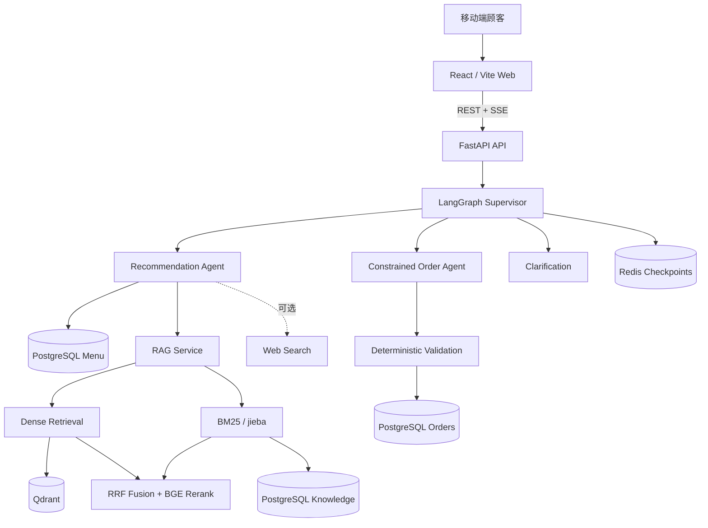

# DD 咖啡馆 · Conversational Ordering Agent

面向餐馆移动端场景的对话式点餐系统 Demo。顾客扫码进入网页后，既可以像传统点餐小程序一样浏览菜单和操作购物车，也可以直接向 AI 描述口味、预算或当下需求，由推荐 Agent 结合真实菜单给出建议；当用户明确表达点单意图时，受约束的订单 Agent 会将准确的商品与规格写入购物车。下单后，顾客仍可继续询问纸巾位置、Wi-Fi、营业时间等餐厅问题。

项目采用 React + FastAPI 的模块化单体架构，以 LangGraph 编排推荐与订单 Agent，PostgreSQL 保存业务事实，Redis 保存短期对话状态，Qdrant 承载可重建的 RAG 向量索引。

> 当前版本使用明确标注的演示菜单和餐厅知识，用于验证“对话能否降低顾客的点餐决策成本”。支付、厨房/POS 对接和真实门店数据不在当前 Demo 范围内。

## 核心能力

- **菜单与对话协同**：保留传统菜单浏览、加购、数量调整和金额展示，同时提供移动端流式对话入口。
- **推荐 Agent**：根据口味、预算和上下文读取实时菜单与餐厅知识，负责推荐和答疑，但没有订单写权限。
- **受约束订单 Agent**：只接受明确、结构化的点单意图；商品、温度、糖度和数量必须与用户表达及菜单数据一致。
- **订单安全边界**：价格、库存、金额和订单状态全部以 PostgreSQL 为准，模型不能通过自由文本直接修改购物车。
- **混合 RAG**：组合向量召回、中文 BM25、RRF 融合、BGE Cross-Encoder 精排、查询改写和证据过滤。
- **持续服务**：提交订单后仍可追加商品、申请取消或继续询问餐厅服务信息。
- **可验证执行**：提供单元测试、Agent 安全 Harness、RAG 检索 Harness、前端测试和生产构建检查。

## 系统架构



### Agent 工作流

```text
用户输入
→ LangGraph Supervisor（规则优先，模型兜底）
→ recommendation | ordering | recommend_then_order | clarify
→ 确定性验证与数据库回读
→ SSE 流式响应
```

推荐 Agent 只读，订单 Agent 受约束。推荐结果可以通过显式 handoff 交给订单 Agent，但任何订单写入都必须经过结构化意图、菜单校验、事务提交和数据库回读。

### RAG 检索链路

```text
Query Rewrite
→ Dense Retrieval + Chinese BM25
→ RRF Fusion
→ BGE Cross-Encoder Rerank
→ Evidence Filter
→ Grounded Answer
```

知识原文、稳定分块和 SHA-256 索引状态保存在 PostgreSQL，Qdrant 仅作为可重建的向量索引。检索失败或证据不足时，系统会回退或明确说明无法确认，不使用模型先验编造餐厅事实。

## 订单严谨性

- 模糊表达不会直接触发购物车写入，而是要求用户澄清。
- 用户明确要求“冰美式”时，系统必须保留商品和冰饮规格，不允许替换成其他美式或默认热饮。
- 所有购物车变更和订单提交均支持持久化幂等，重复请求不会重复加购或重复下单。
- 已提交订单不可修改；后续加购会创建追加订单。
- 取消操作创建待处理请求，为后续员工确认流程保留边界。
- 成功事件只会在事务提交并完成数据库回读后发送。

## 技术栈

| 层级 | 技术 | 作用 |
|---|---|---|
| Web | React 19、TypeScript、Vite、Tailwind CSS | 移动端菜单、购物车和对话界面 |
| API | FastAPI、Pydantic、SQLAlchemy、Alembic | 接口、业务模型和数据库迁移 |
| Agent | LangGraph、DeepSeek | Supervisor、推荐 Agent、订单 Agent 与流式生成 |
| RAG | Qdrant、BGE、BM25、jieba、RRF | 混合召回、融合、精排和证据过滤 |
| Storage | PostgreSQL、Redis | 业务事实、知识文档、幂等记录和短期 Checkpoint |
| Evaluation | Pytest、RAGAS、Vitest、Ruff | Agent 安全、检索质量、前端与代码质量验证 |
| Infrastructure | Docker Compose、pnpm、uv | 本地依赖、包管理和一键验证 |

## 快速开始

### 环境要求

- Docker Desktop
- Python 3.12 与 `uv`
- Node.js、Corepack 与 pnpm
- DeepSeek API Key（可选；无 Key 时使用确定性 Demo Responder）

### 安装依赖

```bash
git clone https://github.com/NDXXXX/DD-Cafe.git
cd DD-Cafe

cp .env.example .env
corepack pnpm install
cd apps/api && uv sync && cd ../..
```

如需接入 DeepSeek，在 `.env` 中填写：

```dotenv
DEEPSEEK_API_KEY=your-real-deepseek-api-key
```

`.env` 已被 Git 忽略，请勿提交真实密钥。

### 启动基础设施

```bash
make infra-up
make db-upgrade
```

分别在两个终端启动 API 和 Web：

```bash
make api
```

```bash
make web
```

打开 <http://localhost:5173>，API 地址为 <http://localhost:8000>。

首次启动后构建 RAG 索引：

```bash
curl -X POST http://localhost:8000/api/knowledge/reindex
```

## 验证

运行完整离线验证：

```bash
make verify
```

该命令依次执行：

- API 单元测试与 Ruff 检查；
- Agent 路由及订单安全 Harness；
- RAG 确定性检索 Harness；
- Web 测试与生产构建；
- Docker Compose 配置校验。

验证本地 BGE Cross-Encoder 精排：

```bash
make eval-rag-reranker
```

配置 DeepSeek Key 后，可运行 Faithfulness、Answer Relevancy、Context Precision 和 Context Recall 四项 RAGAS 评估：

```bash
make eval-ragas
```

## 项目结构

```text
apps/
├── api/
│   ├── app/agents/       LangGraph 状态、Supervisor、推荐与订单 Agent
│   ├── app/orders/       确定性购物车与订单领域服务
│   ├── app/rag/          文档分块、混合检索、融合、精排与重建
│   ├── app/harness/      Agent、RAG 与 RAGAS 评估入口
│   ├── migrations/       Alembic 数据库迁移
│   └── tests/            API、Agent、订单和 RAG 测试
└── web/
    └── src/              移动端菜单、聊天抽屉、购物车与订单状态 UI

data/
├── seed/                 演示菜单与餐厅知识
└── evals/                Agent 和 RAG 评测集

docs/                     产品范围、架构和项目状态
infra/                    PostgreSQL、Redis、Qdrant Compose 配置
```

## 当前范围

当前里程碑是用真实门店菜单和餐厅知识替换演示数据，接入 DeepSeek 后完成模型回答质量评估。以下能力暂不属于第一版：

- 支付与厨房/POS 集成；
- 员工处理取消请求的后台；
- 用户账号、长期顾客画像和多门店租户；
- 二维码生成；
- Kubernetes、Kafka、GraphQL 与微服务拆分。

更详细的设计说明见 [`docs/architecture.md`](docs/architecture.md)，当前实现状态见 [`docs/project-status.md`](docs/project-status.md)。贡献代码前请先阅读 [`AGENTS.md`](AGENTS.md)。
